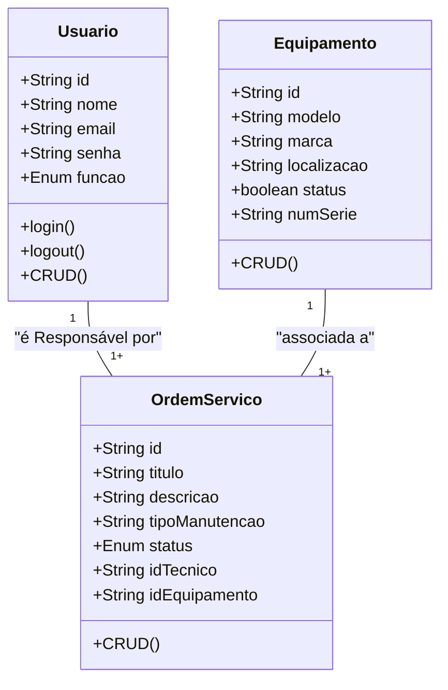

# Sistema de Gestão de Manutenção (SGM) - Formativa

## Briefing
O projeto consiste no desenvolvimento de um Sistema de Gestão de Manutenção (SGM) no formato de uma aplicação web. O objetivo é centralizar e otimizar o controle das atividades de manutenção de máquinas e equipamentos de uma empresa. A plataforma permitirá o cadastro de equipamentos, agendamento de manutenções preventivas e corretivas, e o gerenciamento de ordens de serviço.

## Objetivo do Projeto
- Gerenciar informações sobre equipamento e manutenção realizadas pela empresa
- Realizar abertura de chamado de manutenção (ordens de serviço)
- Dashboard de historicos de manutenção
- Proteger acesso aos dados do sistema (criptografia e autenticação)

## Público-Alvo
- Técnicos de Manutenção (usuários finais)
- Gestores de Manutenção (usuários intermediários)
- Administradores do Sistema (Gerenciar a permissão dos usuários)

## Levantamento de Requisitos do Projeto

- ### Requisitos Funcionais

- ### Requisitos Não Funcionais

## Recursos do Projeto

- ### Tecnológicos
    - Framework de Desenvolvimento Next/React
    - Linguagem de Programação: TypeScript
    - Banco de Dados: Não Relacional (MongoDB)
    - GitHub
    - VSCode
    - Figma

- ### Pessoal
    - Somente Eu 🗿 (aura farming +1000)

## Análise de Risco

## Diagramas

1. ### Classe
Descrever o Compotamento das Entidades de um Projeto

    - Usuário (User/Usuario)
        -Atributos: id, nome, email, senha, função
        -Métodos: create, read, update, delete, login, logout

    - Equipamento (Equipment/Equipamento)
        -Atributos: id, modelo, marca, localização, status, numeroSerie
        -Métodos: CRUD
    
    - Ordem de Serviço (OrdemServico)
        -Atributos: id, titulo, descricao, tipoManuntenção, status, idTecnico, idEquipamento

    

2. ### 

3. ###